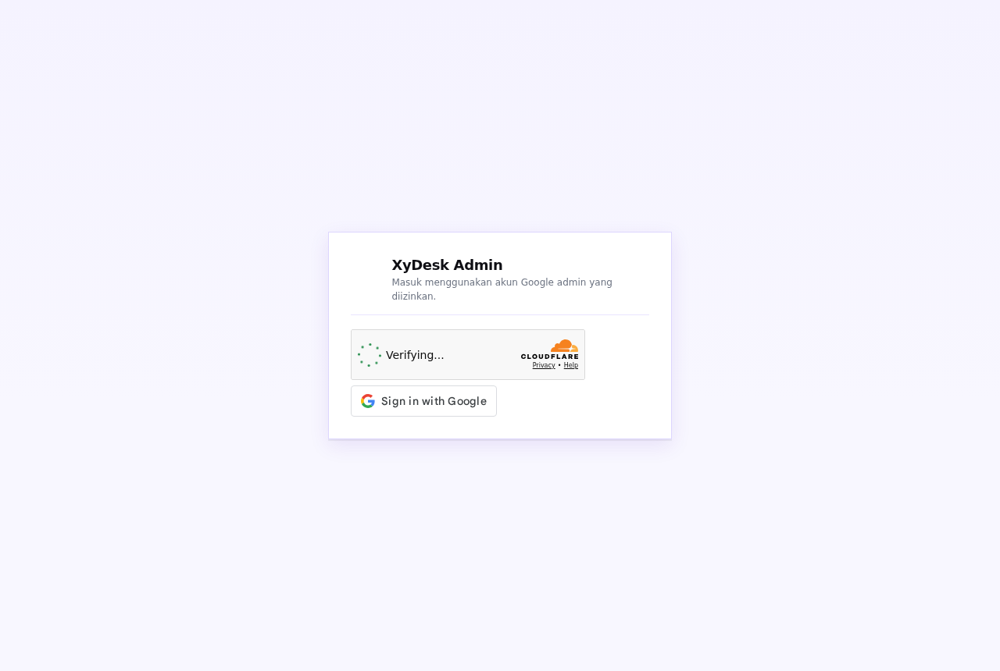

# Admin XyDesk — konfigurasi dan verifikasi

**Status terbaru (17 September 2026): live di https://admin.xydesk.my.id.** OAuth memakai client admin terpisah; widget Turnstile admin sudah terpasang. Source kode `9fa11a8`. Login akun manusia masih perlu smoke test pemilik.

## Login

Build produksi membaca identitas publik dari `.env.production`. Untuk override lokal, salin `.env.example` ke `.env.local`:

- `VITE_GOOGLE_CLIENT_ID`: OAuth Web client ID; tambahkan origin admin yang benar di Google Authorized JavaScript Origins.
- `VITE_TURNSTILE_SITEKEY`: sitekey produksi untuk hostname admin. Tidak ada fallback captcha test.

Worker membutuhkan `ADMIN_GOOGLE_CLIENT_ID` khusus admin (tanpa fallback ke client web/APK), `TURNSTILE_SECRET` (atau `TURNSTILE_SECRET_KEY`), `AUTH_SECRET` (atau `XYDESK_SECRET`), dan allowlist `ADMIN_EMAILS`. Jangan simpan secret di frontend.
`ADMIN_TURNSTILE_HOSTNAMES` dapat diisi daftar hostname dipisahkan koma; default `admin.xydesk.my.id,xydesk-admin.pages.dev`.

Login memakai Google Identity Services dan token Turnstile sekali pakai. Worker memeriksa signature/audience/issuer/expiry/email terverifikasi Google, hostname captcha, dan email allowlist. Sesi berlaku satu jam, membawa `aud=xydesk-admin` serta `role=admin`. JWT lama dan JWT akun biasa tidak diterima oleh endpoint admin. HTTP 401 mengembalikan panel ke Login.

**Dampak rollout:** admin yang sudah login harus masuk ulang. Konfigurasi OAuth dan captcha harus benar sebelum rollout bersama Worker + panel. Belum ada bukti pengujian Google/captcha produksi dari sesi ini.

## Backend & server

`GET /admin/health` memerlukan sesi admin dan memeriksa:

- Worker: handler berhasil merespons.
- AuthStore: RPC pembacaan storage, tanpa mengubah data.
- Hub: RPC statistik koneksi.

Setiap probe punya batas tunggu lima detik. `latencyMs` adalah durasi RPC internal, **bukan** ping perangkat, FPS, latensi streaming, uptime historis, atau bukti kesehatan keseluruhan layanan. HTTP 200 membawa status tiap komponen; komponen dapat `unavailable`.

Belum ada agen kontrol engine/VM terautentikasi. Restart, benchmark, capture test, dan deploy dinyatakan tidak tersedia. Tidak ada perintah shell jarak jauh atau kredensial server yang ditambahkan. `POST /admin/hosting/purge` mengembalikan 501 sampai integrasi sungguhan tersedia.

## Maintenance

Panel mengirim satu POST:

```json
{
  "services": {"web": false, "desktop": false, "android": true, "signal": false},
  "message": "Perawatan Android",
  "revision": 3
}
```

AuthStore memeriksa revisi, menyimpan seluruh flag + audit log dalam transaksi, lalu menaikkan revision. Revisi basi menghasilkan HTTP 409 tanpa menimpa data. Format satu layanan lama (`service`, `enabled`, opsional `message`) masih didukung dan digabung di dalam transaksi; klien lama tanpa revision belum memiliki perlindungan edit basi.

Galat upstream/storage menghasilkan 503, bukan flag false atau sukses palsu. Saat timeout, penulisan bisa saja selesai di backend setelah UI menerima galat: muat ulang sebelum mencoba lagi. Pembacaan publik hanya mengembalikan flag dan pesan, tanpa email pengubah atau revision.

MAU, jumlah seluruh perangkat, sesi aktif/hari ini, dan billing belum punya sumber pengukuran. `/admin/stats` mengirim `null` untuk metrik tersebut; UI menampilkan `—`. Angka Hub adalah koneksi online, bukan riwayat sesi. Konsumen lain wajib mengakomodasi nilai nullable.

## Pemeriksaan lokal

```sh
cd admin
npm install
npm test
npm run build

cd ../cloudflare
npm test
# Node >=22, Wrangler sesuai package.json:
npm run test:runtime
```

Hasil pemeriksaan terakhir 17 September 2026: 15 tes API panel dan 122 tes unit Worker lolos; build panel dan bundling dry-run Worker lolos. Tes unit memakai fetch/storage tiruan, termasuk signature RSA sungguhan dengan kunci uji. `npm run test:runtime` juga lolos pada runtime lokal Wrangler 4.133.0/Miniflare dengan SQLite dan compatibility date 2026-08-17: transaksi batch, konflik konkurensi, patch legacy, audit log, health RPC, dan penolakan akses anonim. Tidak memakai storage produksi.

Uji Chromium pada build panel dengan seluruh API ditirukan juga lolos: health, kontrol engine nonaktif, draft tanpa POST, simpan satu POST, galat status, dan logout 401; tanpa pageerror.

Belum diuji: login akun Google sungguhan, penyelesaian captcha oleh manusia, transaksi storage produksi terautentikasi, dan host Windows/VM. Nomor versi aplikasi tidak dinaikkan. Riwayat preflight dan hasil rollout terbaru dijelaskan di bawah.

## Prioritas berikutnya

1. Verifikasi konfigurasi Google/Turnstile dan lakukan smoke test login di origin resmi saat rollout disetujui.
2. Uji transaksi serta konkurensi pada runtime Durable Object, lalu smoke test maintenance tanpa mengganggu layanan pengguna.
3. Audit dampak bypass login lama dan kebutuhan invalidasi token pada endpoint non-admin. Audience baru menolak token lama di `/admin/*`, bukan pencabutan global semua JWT lama. Rotasi secret global perlu rencana karena bisa memutus sesi web/APK/host.
4. Audit enforcement ban/role/revoke dan kontrak sesi Hub. Tidak dinyatakan selesai oleh perubahan ini.
5. Rancang agen host terautentikasi dengan perintah terbatas, otorisasi per perangkat, audit, dan penanganan reconnect sebelum mengaktifkan kontrol server.


## Riwayat preflight awal — sempat ditahan (17 September 2026)

> Blocker ini diselesaikan memakai client baru khusus admin, bukan dengan mengubah client web. Lihat hasil rollout di akhir dokumen.

Izin operator: verifikasi → push → deploy bila siap; tanpa rotasi secret global, restart host, atau bump versi.

- Akses GitHub push dan token Cloudflare valid; remote main belum memiliki perubahan tambahan saat preflight.
- Client ID publik web produksi cocok dengan lampiran operator: `495336144977-dp1k3678cocjrfhftb9blnqo5qnvhsr6.apps.googleusercontent.com`.
- Chromium memuat GIS asli pada origin `https://admin.xydesk.my.id` (halaman harness dicegat lokal, bukan perubahan situs live). Script GIS HTTP 200; iframe tombol HTTP 403 dengan pesan Google: **The given origin is not allowed for the given client ID.** Origin `https://app.xydesk.my.id` juga ditolak pada pengujian GIS yang sama; ini bukan bukti bahwa alur redirect web yang berbeda ikut gagal.
- Worker produksi `xydesk-signaling` belum memiliki binding `TURNSTILE_SECRET` atau `TURNSTILE_SECRET_KEY`; akun belum mempunyai widget untuk hostname admin. Tidak ada widget/secret produksi yang dibuat atau diubah di sesi ini.
- Endpoint publik `/healthz` saat preflight tetap HTTP 200 (`ok`). Tidak ada login palsu, penulisan maintenance, atau kontrol host yang dicoba di produksi.

### Tindakan pemilik akun Google

Buka Google Cloud Console → APIs & Services → Credentials → OAuth 2.0 Client IDs. Pilih **Web application** dengan Client ID di atas. Tambahkan pada **Authorized JavaScript origins**:

```text
https://admin.xydesk.my.id
```

Jangan mengganti Client ID atau menghapus origin/redirect URI yang sudah ada. Tambahkan `https://xydesk-admin.pages.dev` hanya bila domain tersebut memang akan dipakai untuk login; domain produksi utama adalah admin.xydesk.my.id. Perubahan ini tidak dapat dilakukan dengan token GitHub/Cloudflare yang tersedia. Tidak perlu membagikan password Google atau client secret ke chat.

Setelah tersimpan, ulangi probe GIS; bila origin diterima, buat widget Turnstile khusus hostname admin, simpan secretnya ke Worker melalui secret binding, isi nilai publik build, kemudian rollout backend + panel dan lakukan smoke test di origin resmi. Jangan deploy build lokal tanpa env login.


## Client admin terpisah — lanjutan 17 September 2026

Pemilik membuat OAuth Web client **khusus admin**. Arahan lama untuk menambah origin ke client XyDesk Web tidak dipakai; client web/APK tetap dipertahankan.

- `ADMIN_GOOGLE_CLIENT_ID`: `495336144977-bbtbsdunjrfsfcgki96h6vgq0i5rvs8a.apps.googleusercontent.com`. Origin `https://admin.xydesk.my.id` diterima Google GIS (iframe tombol HTTP 200 dan tombol tampil pada pemeriksaan Chromium).
- Tidak memakai redirect URI; GIS popup mengembalikan credential ke callback JavaScript. Client secret tidak dipakai aplikasi atau Worker dan tidak masuk Git.
- Widget Turnstile **XyDesk Admin** dibuat khusus hostname admin.xydesk.my.id, mode managed. Sitekey publik `0x4AAAAAAE6jQZaig7vJKhQs`; secretnya disiapkan melalui secret binding, tanpa menimpa secret web/APK.
- Secret/client ID dari lampiran diarsipkan sesuai permintaan pemilik di `uploads/kuncikerjasama.txt`, di luar repo.
- Tes audience admin berhasil, audience web ditolak, dan admin tanpa client ID khusus gagal tertutup.
- Rollout tetap memerlukan smoke test pasca-aktivasi; login akun dan penyelesaian captcha oleh manusia tidak dilakukan otomatis.


## Hasil rollout produksi — 17 September 2026

- Kode `9fa11a8` sudah di main sebelum kedua versi diunggah.
- Worker `xydesk-signaling`: `1a892f50-9d4a-4257-98b1-6931c8dc7234`, menerima 100% trafik.
- Panel `xydesk-admin`: `f69c671d-9bb2-4773-8ee2-f93b864599ef`, menerima 100% trafik.
- Upload memakai versi bertahap (`versions upload`) lalu aktivasi eksplisit (`versions deploy`). Seluruh binding lama diperiksa tetap tersedia; hanya menambah `ADMIN_GOOGLE_CLIENT_ID` dan `TURNSTILE_SECRET`. Tidak merotasi secret global, mengubah client web/APK, atau restart engine.
- Bundle live `index-CHwcNrpT.js` cocok dengan build lokal, SHA256 `7ea70558e3545cce15e15518240e35cb2394e339792de6b55eadcec3be60719d`.
- Smoke test live: HTML/JS 200, `/healthz` 200; GET health/stats admin tanpa sesi 401; GET maintenance publik 200 tanpa metadata pengubah; POST maintenance tanpa sesi 401 (tidak menulis storage); login dengan captcha palsu 403.
- Chromium membuka situs produksi tanpa routing tiruan: tombol Google dan iframe Turnstile HTTP 200, tombol login terlihat, tanpa pageerror dan tanpa pesan galat login.
- **Belum terbukti end-to-end:** login akun admin sungguhan, penyelesaian captcha oleh manusia, health setelah login, serta perubahan maintenance terautentikasi di produksi. Tidak memasukkan akun/password atau mencoba bypass captcha.

Screenshot berikut diambil dari halaman login produksi setelah rollout, bukan mockup:



Versi aplikasi tetap 6.8.5. Ini rollout perbaikan layanan, tanpa tag rilis, APK/desktop build, atau publikasi berita. Jangan rollback otomatis ke versi lama karena kode lama memuat bypass login; jika ada masalah, utamakan perbaikan maju atau pembatasan akses sementara dengan persetujuan operator.
