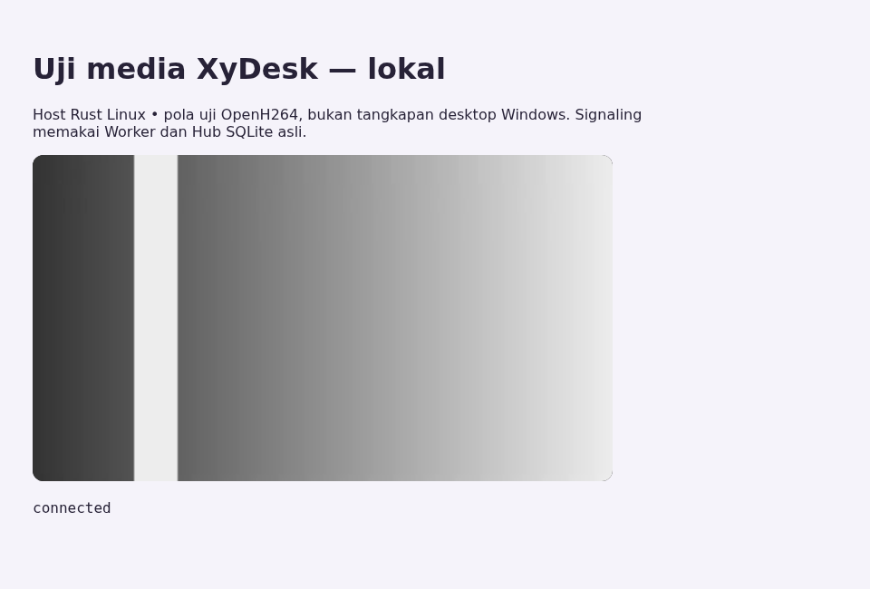

# Bukti inti remote desktop — 17 September 2026

Status: **jalur media lokal lulus; remote desktop Windows/internet belum dinyatakan selesai.**
Sesi `SESI-20260917-OPERATOR-REMOTECORE`, Operator - XyDesk Team.

## Yang benar-benar dijalankan

Bukan host browser tiruan: tes memakai **binary `xydesk-host` Rust**, kode
`RtcSession` web asli, dan Worker + Hub/AuthStore SQLite di Miniflare.
Halaman penampil adalah harness pengujian, bukan screenshot aplikasi produksi.

| Tahap | Bukti |
|---|---|
| Registrasi perangkat | `/host-token` melakukan claim ke AuthStore; binary mendapat `welcome` dari Hub |
| Pairing salah | Ditolak; control API host tetap tanpa sesi |
| Pairing benar | Offer/answer dan ICE menghasilkan koneksi nyata |
| Video | Chromium melaporkan `video/H264`, `framesDecoded >= 5`, ukuran 320×180; piksel video tergambar di canvas, bukan bidang kosong |
| Jaringan | Kandidat terpilih **host → host**, direct lokal; bukan TURN |
| Perintah balik | Pesan biner browser melewati data channel dan decoder host; target bitrate terbaca kembali sebagai 3.000.000 bps |
| Kick host | Sesi host menjadi kosong dan frame berhenti; host bisa mendaftar/pairing ulang |
| Kick client | Client sengaja mengabaikan callback close; Hub tetap memberi tahu host, dan media berhenti |
| Putus manual | Browser mengirim bye; slot host bebas tanpa menunggu ICE timeout |

[Baca hasil mesin](qa/remote-core-2026-09-17.json).



## Bug yang ditemukan dan diperbaiki

1. **Media bertahan setelah signaling diputus.** Menjatuhkan `Arc` lokal tidak
   menutup sesi yang masih dipegang task dan control state. Pada reproduksi
   sebelum perbaikan, counter browser bertambah dari 7 ke **135 frame** setelah
   kick, dengan input tetap `open`. Host sekarang mencabut izin dan menutup
   peer sebelum reconnect. Rem brute force tidak direset.
2. **Kick client bergantung pada client.** Hub sekarang menyimpan hubungan
   media dari answer host dalam attachment hibernasi, lalu mengirim bye hanya
   ke pihak yang terkait. Ikatan menggunakan nonce socket, bukan ID yang bisa
   dipakai ulang. Kick tidak menunggu client bersedia menyelesaikan close.
3. **`--stun ""` menggagalkan offer.** CLI mendokumentasikannya sebagai LAN-only,
   tetapi URL kosong sebelumnya masuk ke pemeriksa URI WebRTC dan membuat
   binary keluar dengan `unknown scheme type`. URL kosong kini disaring.
4. **Lifecycle web.** Fase terminal menutup media dan signaling; operasi SDP/ICE
   diantrekan agar kandidat menunggu remote description. Jawaban rusak menjadi
   galat terkontrol. Pesan media dari host lain diabaikan. Stop saat menunggu
   TURN tidak membuat peer terlambat. ID client memakai UUID.
5. **Data dan diagnosis web.** Clipboard biner memakai `arraybuffer`; track
   tanpa stream ditangani; label codec dibaca dari record `codecId` yang nyata.
   Pesan penolakan tidak langsung terhapus oleh transisi fase.
6. Lockfile host tertinggal pada 6.7.12. Diselaraskan dengan manifest **6.8.5
   yang sudah ada**, tanpa menetapkan versi baru atau mengubah dependensi.
   Pembacaan tipe NAL FU-A di tes loopback juga dikoreksi.

## Pemeriksaan akhir

- Rust: `cargo fmt --check`, `cargo test --locked`: **122 unit library + 5 unit binary + 1 loopback** lulus.
- Worker: **151/151** tes lulus.
- Web: **19/19** tes lulus; `tsc -b && vite build` lulus.
- Harness lintas runtime: **PASS**, termasuk delapan tahap di tabel.
- Tidak ada deploy, dispatch rilis, rotasi secret, atau restart host produksi.
- Build web ini untuk pemeriksaan lokal; bukan bundle siap deploy dengan konfigurasi OAuth produksi.

## Cara menjalankan ulang

Prasyarat: Rust + compiler C/C++ dan NASM untuk OpenH264, Node 22, serta library
sistem yang dibutuhkan Chromium. Dependensi yang dipakai sudah ada di repo.

```sh
cd host
cargo test --locked
cd ..
npm ci --prefix cloudflare
npm ci --prefix web
npm ci --prefix web/e2e
cd web/e2e
npx playwright install --with-deps chromium
cd ../..
REMOTE_REPORT_DIR="$PWD/local-remote-report" npm run test:remote --prefix cloudflare
```

Harness menggunakan identitas/secret fixture, port loopback sementara, SQLite
sementara, dan `XYDESK_HOME` terpisah. Tidak membaca kredensial produksi.
Browser tetap memakai konfigurasi STUN publik kode web, tetapi tes mewajibkan
pasangan kandidat terpilih direct lokal. Semua proses tes ditutup saat selesai.
`XYDESK_TEST_HOST` dapat menunjuk binary uji alternatif.

## Yang belum terbukti / pekerjaan berikutnya

1. **Windows nyata:** capture DXGI/GDI/WGC, fallback encoder, NVENC, monitor
   terpilih, layar terkunci, dan desktop interaktif. Linux hanya pola uji.
2. **Mouse/keyboard Windows:** paket dikirim dalam tes ini, tetapi `Injector`
   Linux memang no-op. Belum ada bukti pointer bergerak atau teks masuk ke
   aplikasi Windows. Uji nyata wajib sebelum menyatakan remote control selesai.
3. **Internet/TURN:** host saat ini hanya diberi STUN di `main.rs`; endpoint
   `/turn-ice` menerima token role client, bukan host. Perlu rancangan distribusi
   kredensial relay untuk host dan pengujian jaringan yang memblokir UDP.
   Satu relay di sisi client bukan bukti semua jenis jaringan sudah didukung.
4. **Flutter/Android:** lifecycle `_fail()` saat ini hanya mengubah fase;
   parity cleanup dan urutan ICE perlu diuji dengan SDK/perangkat. SDK Flutter
   tidak tersedia pada sesi ini; tidak ada klaim `flutter test` lulus.
5. **Stabilitas dan performa:** belum uji 30 menit, kebocoran task/audio saat
   reconnect berulang, 1080p60, atau glass-to-glass. Angka 320×180 bukan bukti
   target latency/1080p terpenuhi. Audio dua arah juga belum diuji.
6. **Isolasi galat host:** beberapa galat SDP/ICE masih merambat lewat `?` dari
   loop utama. Perlu memastikan satu negosiasi rusak tidak mematikan engine.
7. **Sisa kontrol backend:** ban/revoke/token yang sudah diterbitkan, terminasi
   sesi lama lintas versi, dan server-agent terautentikasi belum selesai diaudit.
8. **Keamanan akun admin:** ganti password, reenrollment TOTP, regenerasi recovery,
   reauthentication, dan pencabutan sesi terkait masih antre. Tidak mereset akun
   pemilik atau seed secara otomatis.

### Gerbang rollout

Perubahan ini masih kode yang diuji lokal. Ikatan media Hub baru dibuat saat
**answer baru**; sesi yang sudah aktif sebelum upgrade tidak otomatis memiliki
attachment tersebut. Rollout harus mencakup reconnect sesi uji yang disepakati,
verifikasi kompatibilitas host/client, dan pemeriksaan ulang pemutusan media.
Build/rilis Windows, deploy layanan, dan pergantian host produksi tetap menunggu
persetujuan terpisah. Akun admin produksi yang sudah diaktifkan tidak diubah.

## Bahan artikel pengguna — belum diterbitkan

Koneksi yang diputus kini ditangani sampai ke jalur video, bukan hanya label
status. Host dapat dipakai kembali setelah koneksi putus, dan client mendapat
alasan kegagalan yang lebih jelas. Bukti screenshot di atas hanya menunjukkan
uji media Linux; **jangan digunakan sebagai klaim bahwa desktop Windows atau
performa internet telah lolos**. Materi pengguna final menunggu lab perangkat.
